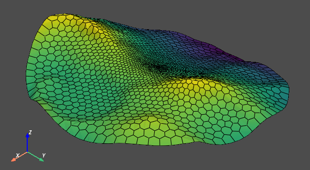

# voromesh

## Features

- Creates meshes from a bounded Voronoi diagram of a 2D point cloud
- Extrude 2D surface meshes to 3D
- Export as VTU or MESH for [TOUGH3](https://tough.lbl.gov/)

## Dokumentation

Voromesh was designed for setting up conceptual simulations models for carbon dioxide storage.  The documention including workflows can be found here.

## Quickstart

1. Clone the repro: `git clone https://github.com/jtecklenburg/voromesh.git`
2. Install with pip locally: Change to folder with setup.py and run `pip install -e .`
or
1. Install with pip from Github: `pip install git+https://github.com/jtecklenburg/voromesh.git@main`

## Notice

This software was developed at [Bundesanstalt für Geowissenschaften und Rohstoffe (BGR) in Hannover](https://www.bgr.bund.de/EN/Home/homepage_node_en.html)

The project leading to this software has received funding from the European Union’s Horizon 2020 research and innovation programme under grant agreement "LEILAC2 - Low Emission Intensity Lime and Cement" GA 884170.

